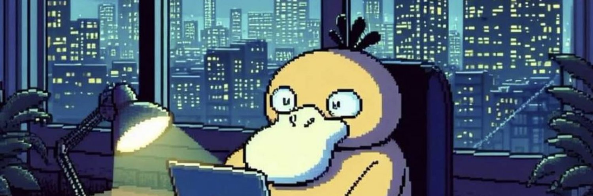
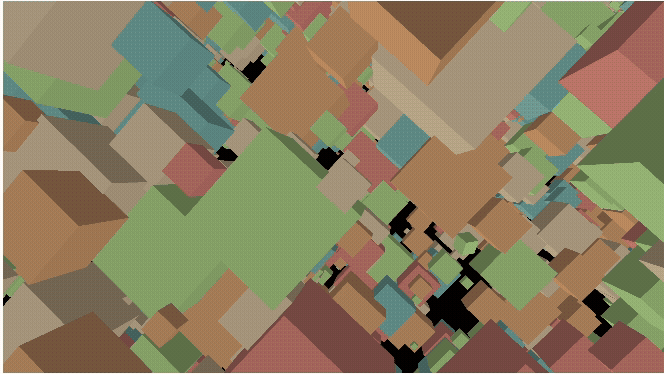
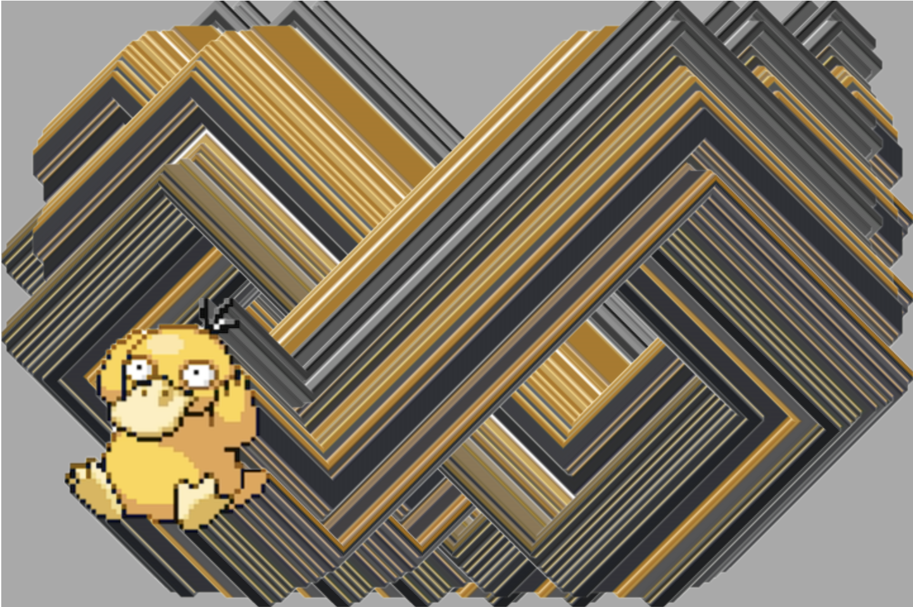
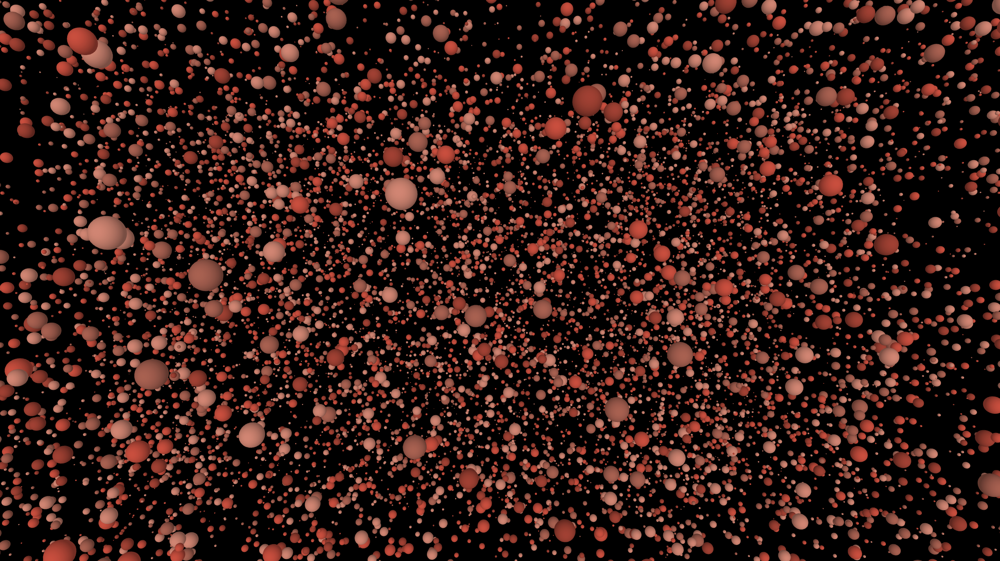
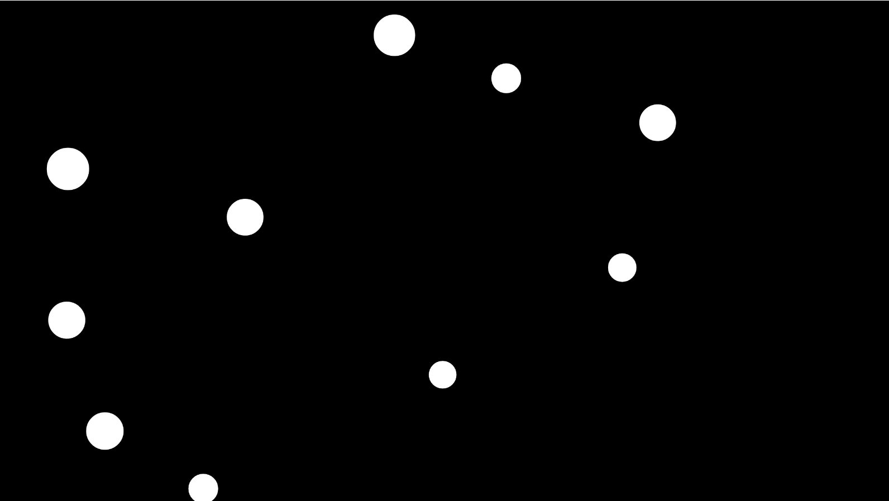
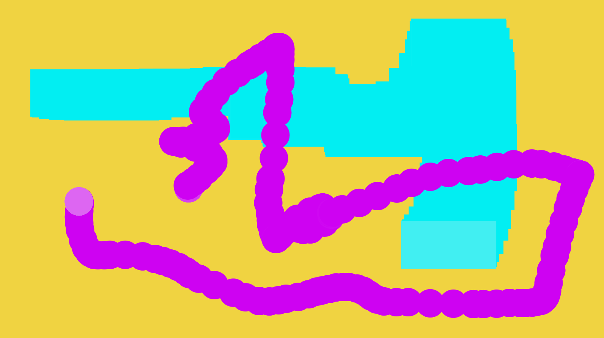
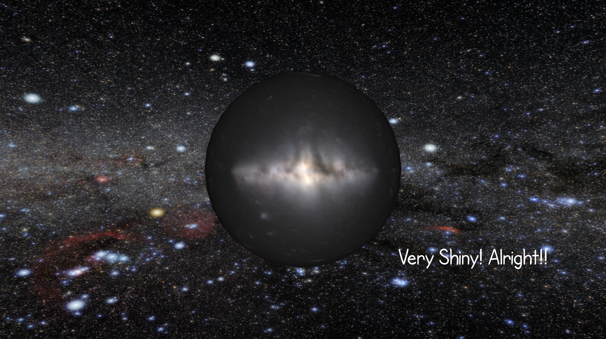

# CART 253 Course Website

Matthew Thompson. Student No.40352579

## Welcome

A collection and showcase of various protoypes created Fall 2026

## In Class Challenges

[Week 1 - Version Control](https://mashuu83.github.io/cart253/topics/weekly-challenges/version-control/version-control-workflow/index.html) | [Week 2 - Landscape](https://mashuu83.github.io/cart253/topics/weekly-challenges/instructions-challenge/index.html) | 
[Week 3 - Mr Furious](https://mashuu83.github.io/cart253/topics/weekly-challenges/variables-challenge/index.html) | [Week 4 - Moving Puck](https://mashuu83.github.io/cart253/topics/weekly-challenges/conditionals-challenge/index.html) | [Week 5 - The Only Move is Not to Play](./topics/weekly-challenges/events-challenge/index.html)

## Instructions Prototypes - Week 2

[Funny Color Names and Slow Rotations](https://mashuu83.github.io/cart253/topics/prototypes/instructions/1-fcnsr/index.html) | [Code](https://github.com/mashuu83/cart253/blob/main/topics/prototypes/instructions/1-fcnsr/js/script.js)

---

[Juggler](https://mashuu83.github.io/cart253/topics/prototypes/instructions/2-juggler/index.html) | [Code](https://github.com/mashuu83/cart253/blob/main/topics/prototypes/instructions/2-juggler/js/script.js)

---

[A Lotta Cubes](https://mashuu83.github.io/cart253/topics/prototypes/instructions/3-lottacubes/index.html) | Refresh the page to generate a new drawing, move the camera by dragging and scrolling | [Code](https://github.com/mashuu83/cart253/blob/main/topics/prototypes/instructions/3-lottacubes/js/script.js) |

---

## Variables Prototypes - Week 3
<!-- Can I insert a GIF as my screenshot here I wonder? -->

[Odd One Out](https://mashuu83.github.io/cart253/topics/prototypes/variables/1-findthecube/) | Try and find the solitary cube rotating the opposite direction from the others. Use left/right drag to pan/tilt and scroll to zoom. Refresh the page to generate a new puzzle. | [Code](https://github.com/mashuu83/cart253/blob/main/topics/prototypes/variables/1-findthecube/js/script.js)

---

[Psyduck Screensaver](https://mashuu83.github.io/cart253/topics/prototypes/variables/2-psyduckdvd/) | [Code](https://github.com/mashuu83/cart253/blob/main/topics/prototypes/variables/2-psyduckdvd/js/script.js)

---

[Palette Swap](./topics/prototypes/variables/3-paletteshift/index.html) |Click the Image to cycle through different palettes| [Code](https://github.com/mashuu83/cart253/blob/main/topics/prototypes/variables/3-paletteshift/js/script.js)

---

## Conditionals Prototypes - Week 4

[Floaty Ghosts](https://mashuu83.github.io/cart253/topics/prototypes/conditionals/1-floatyghosts/index.html) |Use the mouse cursor to scare the ghosts!| [Code](https://github.com/mashuu83/cart253/blob/main/topics/prototypes/conditionals/1-floatyghosts/js/script.js)

---

[Shape Trails](https://mashuu83.github.io/cart253/topics/prototypes/conditionals/2-shapetrails/index.html)| Drag the shapes around the canvas to leave trails, The flashing shape indicates the draggable area | [Code](https://github.com/mashuu83/cart253/blob/main/topics/prototypes/conditionals/2-shapetrails/js/script.js)

---

[Shiny Planet](https://mashuu83.github.io/cart253/topics/prototypes/conditionals/3-shinyplanet/index.html) | Click to see how Shiny your planet will be, click again to retry | [Code](https://github.com/mashuu83/cart253/blob/main/topics/prototypes/conditionals/3-shinyplanet/js/script.js) |

## Reflective Journal Entries

[Week 1 Reflection (Version Control)](https://mashuu83.github.io/cart253/topics/journal/journal) | [Week 2 Reflection (Instructions)](https://mashuu83.github.io/cart253/topics/journal/journal2) | [Week 3 Reflection (Variables)](https://mashuu83.github.io/cart253/topics/journal/journal3) | [Week 4 Reflection (Conditionals)](https://mashuu83.github.io/cart253/topics/journal/journal4)

### Attributions
Header Image taken from https://x.com/monmons137/header_photo
Artist was credited as @terrythefox (TikTok) though I could not find the artists personal site/profile.
Psyduck Image for Screensaver prototype from IGN
